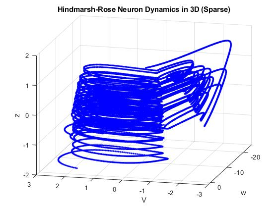
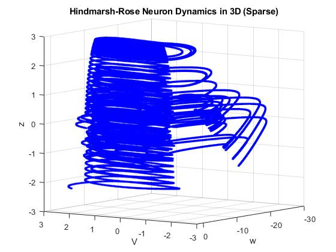

# Hindmarsh-Rose Neuron Dynamics in 3D Simulation




This repository contains MATLAB code that simulates the dynamics of a network of Hindmarsh-Rose neurons in three dimensions. The code is based on the Hindmarsh-Rose model, a mathematical representation of neuron behavior developed by Hindmarsh and Rose in 1984.

## Overview

The simulation involves modeling the electrical behavior of Hindmarsh-Rose neurons in a 3D space. The neurons' dynamics are governed by a set of ordinary differential equations, capturing aspects such as spiking, bursting, and adaptation.
## Parameters and Model

The simulation is controlled by various parameters including the number of neurons, simulation time, and model constants. These parameters can be adjusted in the script to observe different behaviors.

The core Hindmarsh-Rose model equations used in the simulation are:

dV/dt = w - a * V^3 + b * V^2 - z + I_ext
dw/dt = c - d * V^2 - w
dz/dt = r * (s * (V - V_rest) - z)

Where:

V is the membrane potential.
w is the recovery variable.
z is the slow adaptation variable.
a, b, c, and d are constants.
r is the timescale of the slow adaptation.
s is the steepness of the sigmoid function.
V_rest is the resting potential of the neuron.
I_ext is the external input current.
For a detailed understanding of these equations, refer to the paper: https://analogparadigm.com/downloads/alpaca_41.pdf

## Getting Started

1. Clone this repository:

   ```bash
   git clone https://github.com/victormeloasm/HindmarshRose3D.git
   ```

2. Install MATLAB on your computer.

3. Open MATLAB and navigate to the cloned repository.

4. Run the `HindmarshRose3D.m` script to simulate the neuron dynamics and visualize the results.

## Parameters and Model

The simulation is controlled by various parameters including the number of neurons, simulation time, and model constants. These parameters can be adjusted in the script to observe different behaviors.

The core Hindmarsh-Rose model equations used in the simulation can be found in the paper: https://analogparadigm.com/downloads/alpaca_41.pdf

## Examples

Here are two example images generated from the simulation:


*Example 1: Neuron dynamics in 3D space.*


*Example 2: Neuron trajectories.*

## Acknowledgments

This simulation is inspired by the Hindmarsh-Rose model and the paper "[Reference Paper](https://analogparadigm.com/downloads/alpaca_41.pdf)" by [Dr. Bernd Ulmann]. The code in this repository is for educational purposes and can be further extended for research and experimentation.

## License

This project is licensed under the [MIT License](LICENSE).

---
For any questions or inquiries, please contact victormeloasm@gmail.com.
